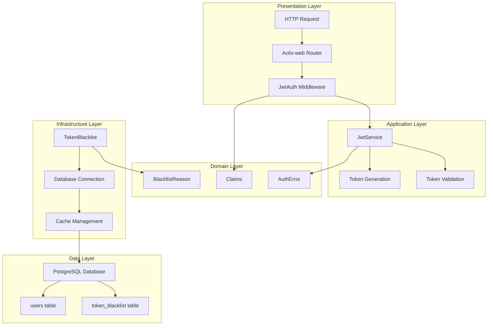
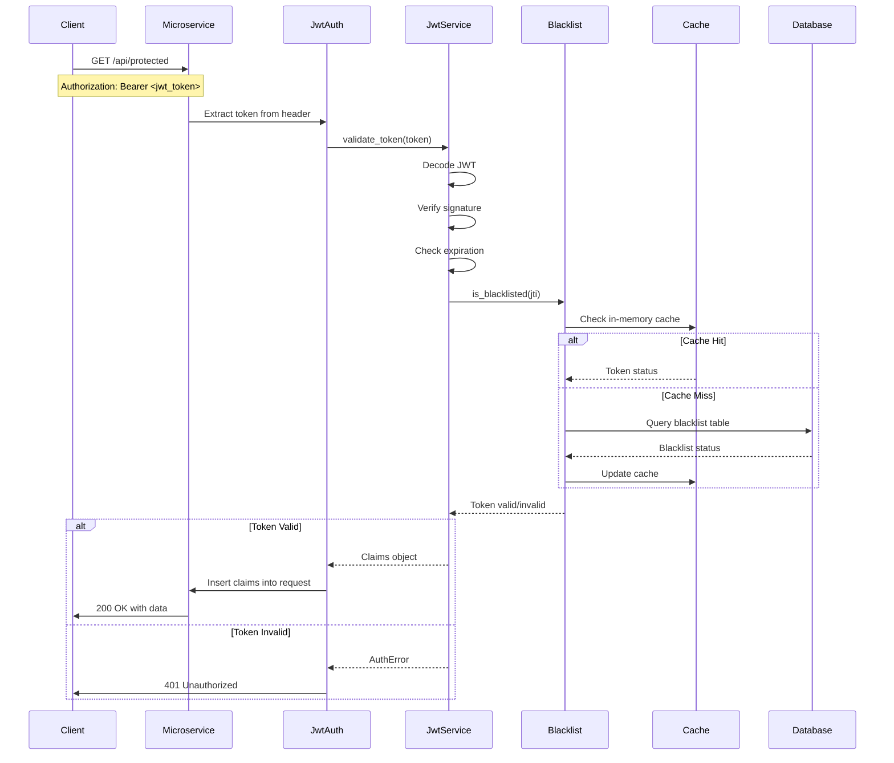
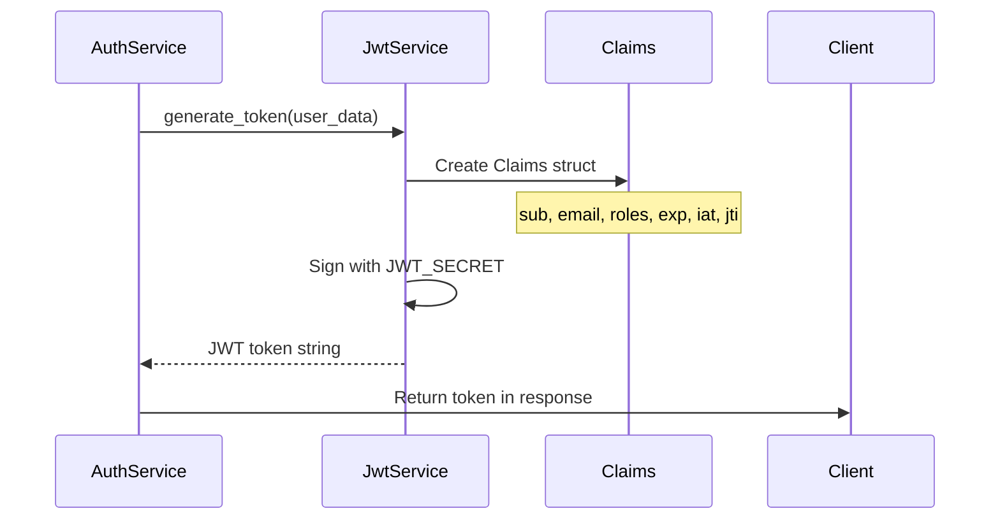
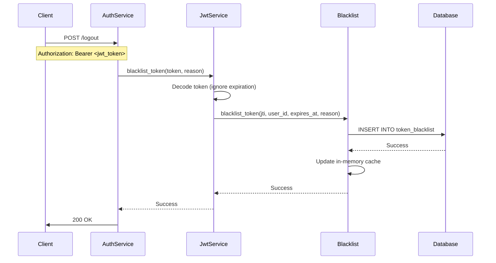
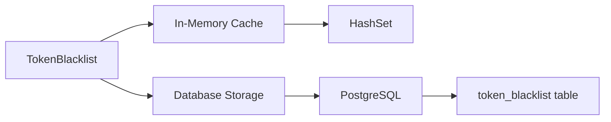
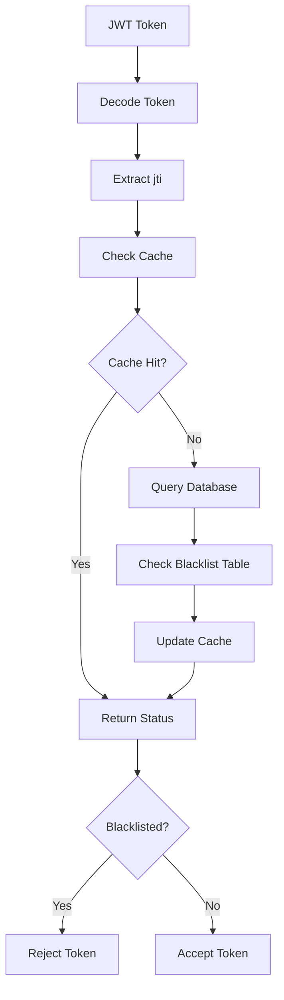
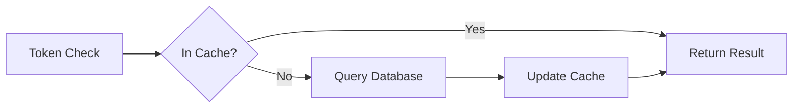
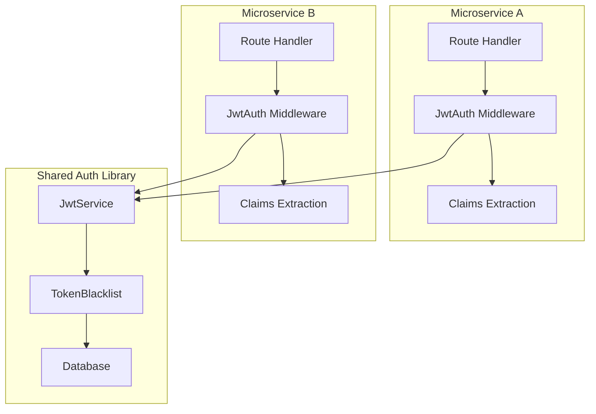
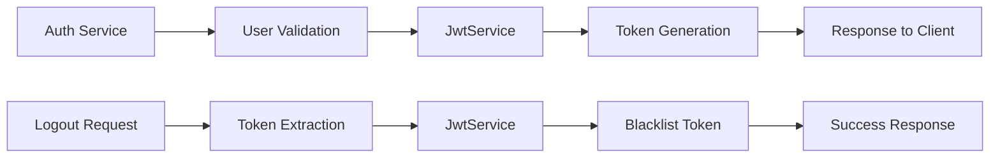

# 🏗️ Shared Authentication Architecture

This document provides a detailed technical overview of the shared authentication system architecture, including component interactions, data flow, and design decisions.

## 📊 System Overview

The shared authentication system is designed as a centralized library that provides JWT-based authentication capabilities to multiple microservices. It follows a layered architecture pattern with clear separation of concerns.

## 🏛️ Architecture Layers



## 🔄 Request Flow

### Authentication Flow



### Token Generation Flow



### Logout Flow



## 🧩 Component Details

### 1. JwtService

**Purpose**: Core service for JWT operations

**Key Responsibilities**:
- Token generation and signing
- Token validation and decoding
- Integration with blacklist system
- Error handling and logging

**Key Methods**:
```rust
impl JwtService {
    pub fn generate_token(&self, user_id, email, company_id, roles, expires_in_hours) -> Result<String, AuthError>
    pub async fn validate_token(&self, token: &str) -> Result<Claims, AuthError>
    pub async fn blacklist_token(&self, token: &str, reason: BlacklistReason) -> Result<(), AuthError>
}
```

### 2. TokenBlacklist

**Purpose**: Manages token revocation and blacklisting

**Key Responsibilities**:
- Store blacklisted tokens in database
- Maintain in-memory cache for performance
- Provide blacklist statistics
- Automatic cleanup of expired entries

**Architecture**:


### 3. JwtAuth Middleware

**Purpose**: Actix-web middleware for authentication

**Key Responsibilities**:
- Extract JWT from Authorization header
- Validate tokens using JwtService
- Inject claims into request extensions
- Handle authentication errors

**Integration Pattern**:
```rust
App::new()
    .wrap(JwtAuth::new(jwt_service.clone()))
    .service(protected_routes)
```

### 4. Claims Structure

**Purpose**: JWT payload representation

**Structure**:
```rust
pub struct Claims {
    pub sub: i32,              // User ID
    pub email: String,         // User email
    pub company_id: Option<i32>, // Company ID
    pub roles: Vec<String>,    // User roles
    pub exp: usize,           // Expiration timestamp
    pub iat: usize,           // Issued at timestamp
    pub jti: String,          // JWT ID (for blacklisting)
    pub session_id: Option<String>, // Session ID
}
```

## 🗄️ Database Design

### Token Blacklist Schema

```sql
CREATE TABLE authentication.token_blacklist (
    id SERIAL PRIMARY KEY,
    jti VARCHAR(255) NOT NULL,           -- JWT ID (unique identifier)
    user_id INTEGER NOT NULL,            -- Associated user
    expires_at TIMESTAMPTZ NOT NULL,     -- Token expiration time
    blacklisted_at TIMESTAMPTZ NOT NULL, -- When token was blacklisted
    reason VARCHAR(100) NOT NULL,        -- Reason for blacklisting
    created_at TIMESTAMPTZ NOT NULL,
    updated_at TIMESTAMPTZ NOT NULL
);
```

**Indexes for Performance**:
```sql
CREATE INDEX idx_token_blacklist_jti ON authentication.token_blacklist(jti);
CREATE INDEX idx_token_blacklist_user_id ON authentication.token_blacklist(user_id);
CREATE INDEX idx_token_blacklist_expires_at ON authentication.token_blacklist(expires_at);
```

### Data Flow Diagram



## 🔒 Security Architecture

### JWT Security Model

```mermaid
graph TB
    subgraph "JWT Security Layers"
        A[Token Generation] --> B[Strong Secret]
        B --> C[HS256 Algorithm]
        C --> D[Expiration Time]
        D --> E[Unique JTI]
        
        F[Token Validation] --> G[Signature Verification]
        G --> H[Expiration Check]
        H --> I[Blacklist Check]
        I --> J[Claims Extraction]
    end
    
    subgraph "Blacklist Security"
        K[Database Storage] --> L[Encrypted Connection]
        L --> M[Access Control]
        M --> N[Audit Logging]
    end
    
    subgraph "Infrastructure Security"
        O[Environment Variables] --> P[Secret Management]
        P --> Q[HTTPS Only]
        Q --> R[Rate Limiting]
    end
```



### Security Considerations

1. **JWT Secret Management**
   - Use cryptographically secure secrets
   - Rotate secrets regularly
   - Store secrets in environment variables

2. **Token Security**
   - Set appropriate expiration times
   - Use HTTPS in production
   - Implement token refresh mechanism

3. **Database Security**
   - Use SSL/TLS connections
   - Implement connection pooling
   - Regular security updates

4. **Access Control**
   - Limit database access
   - Implement role-based access
   - Monitor authentication failures

## 📈 Performance Considerations

### Caching Strategy



**Cache Configuration**:
- **Type**: In-memory HashSet
- **Size**: Unlimited (managed by cleanup task)
- **TTL**: Until token expiration
- **Update Strategy**: Write-through

### Database Optimization

1. **Connection Pooling**
   ```rust
   let pool = r2d2::Pool::builder()
       .max_size(3)  // Limit connections per service
       .min_idle(Some(1))  // Keep minimum connections
       .connection_timeout(Duration::from_secs(10))
       .build(manager)
   ```

2. **Index Strategy**
   - Primary index on `jti` for fast lookups
   - Secondary index on `user_id` for bulk operations
   - Index on `expires_at` for cleanup operations

3. **Cleanup Strategy**
   - Automatic removal of expired entries
   - Background task runs every hour
   - Batch deletion for performance

## 🔄 Integration Patterns

### Microservice Integration



### Authentication Service Integration



## 🧪 Testing Strategy

### Unit Testing

```rust
#[cfg(test)]
mod tests {
    use super::*;
    
    #[tokio::test]
    async fn test_token_generation_and_validation() {
        // Test token generation
        // Test token validation
        // Test blacklisting
    }
}
```

### Integration Testing

1. **Database Integration Tests**
   - Test blacklist persistence
   - Test cache synchronization
   - Test cleanup operations

2. **Middleware Integration Tests**
   - Test authentication flow
   - Test error handling
   - Test claims extraction

3. **Performance Tests**
   - Test concurrent token validation
   - Test cache performance
   - Test database connection limits

## 📊 Monitoring and Observability

### Metrics to Track

1. **Authentication Metrics**
   - Token validation success rate
   - Token generation rate
   - Blacklist operations per second

2. **Performance Metrics**
   - Cache hit ratio
   - Database query latency
   - Memory usage

3. **Security Metrics**
   - Failed authentication attempts
   - Token blacklist size
   - Expired token cleanup rate

### Logging Strategy

```rust
tracing::info!("🔐 Shared authentication initialized successfully");
tracing::warn!("Token validation failed: {}", error);
tracing::error!("Database connection failed: {}", error);
```

## 🚀 Deployment Considerations

### Environment Configuration

1. **Development**
   - Local PostgreSQL instance
   - Debug logging enabled
   - Shorter token expiration

2. **Staging**
   - Shared database instance
   - Performance monitoring
   - Security testing

3. **Production**
   - High-availability database
   - Comprehensive monitoring
   - Security hardening

### Scalability Considerations

1. **Horizontal Scaling**
   - Stateless design allows multiple instances
   - Shared database for blacklist consistency
   - Load balancer distribution

2. **Database Scaling**
   - Read replicas for blacklist queries
   - Connection pooling limits
   - Regular cleanup maintenance

3. **Cache Scaling**
   - In-memory cache per instance
   - Cache warming strategies
   - Memory usage monitoring

---

This architecture provides a robust, scalable, and secure authentication system that can be easily integrated into any microservices ecosystem.

---

**📧 Contact**: [Eshya](mailto:achmadayas@gmail.com) 